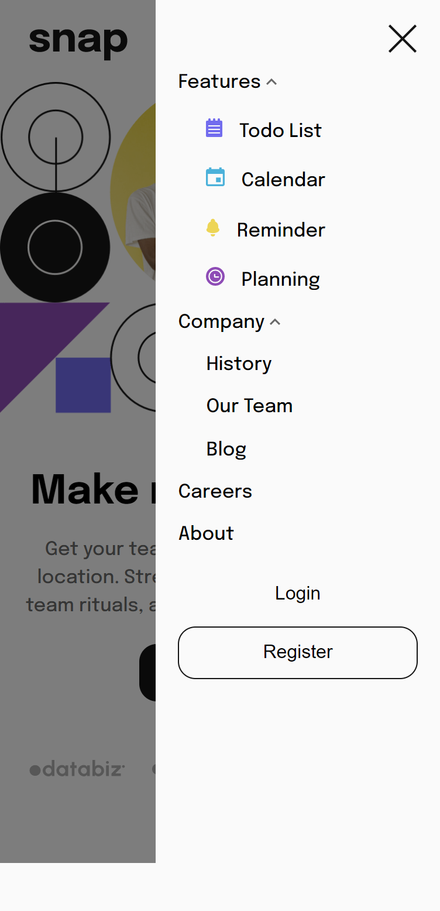

# Frontend Mentor - Intro section with dropdown navigation solution

This is a solution to the [Intro section with dropdown navigation challenge on Frontend Mentor](https://www.frontendmentor.io/challenges/intro-section-with-dropdown-navigation-ryaPetHE5). Frontend Mentor challenges help you improve your coding skills by building realistic projects. 

## Overview

### The challenge

Users should be able to:

- View the relevant dropdown menus on desktop and mobile when interacting with the navigation links
- View the optimal layout for the content depending on their device's screen size
- See hover states for all interactive elements on the page

### Screenshot

- Desktop screenshot

- Mobile screenshot

### Links

- Live Site URL: (https://ivankoshan2004.github.io/frontendmentor-intro-section-with-dropdown-navigation-main/)

## My process

### Built with

- HTML, CSS
- Mobile-first workflow

### What I learned

Building this small project, I've learned how to create a basic menu for mobile sites.

### Continued development

I want to add an additional feature to the mobile version. That is, swiping the menu from the sides. 

## Author

- Frontend Mentor - [@IvanKoshan2004](https://www.frontendmentor.io/profile/IvanKoshan2004)
